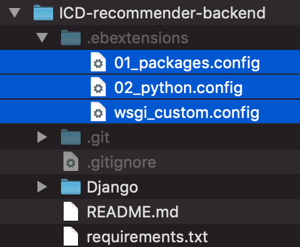
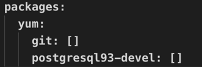
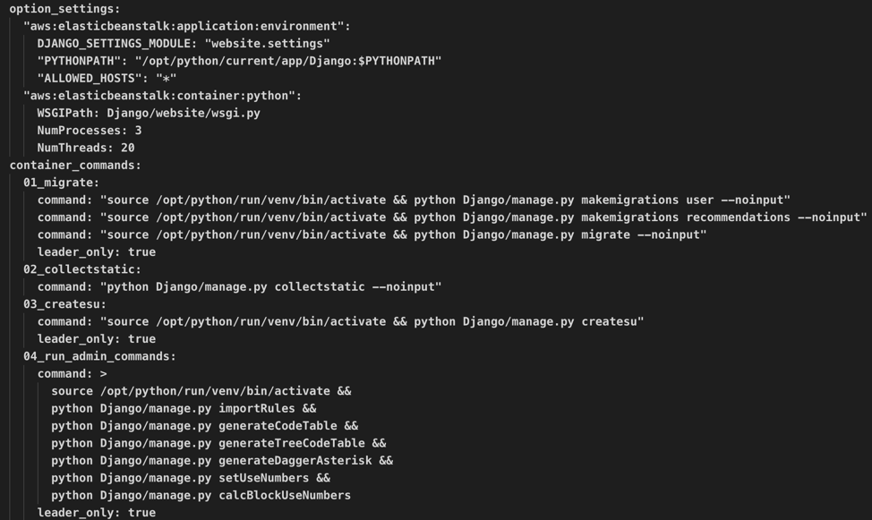
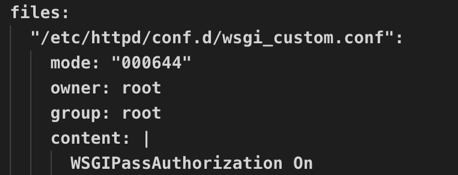
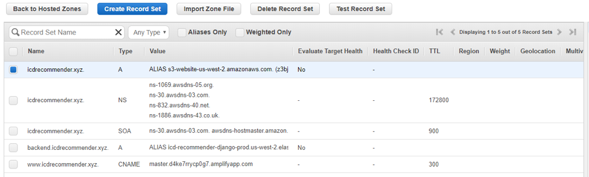

## Setting up local development server

1. Install the required dependencies
```
pip install -r requirements.txt
```

2. Set up the following environment variables:
Postgres SQL development server settings:
```
RDS_DB_NAME
RDS_USERNAME
RDS_PASSWORD
RDS_HOSTNAME
RDS_PORT
```
Django development server settings:
```
DJANGO_ADMIN_PASSWORD
DJANGO_SECRET_KEY
DJANGO_ICD_DATA_LOCATION
DJANGO_DEBUG
```
Email server settings:
```
DJANGO_EMAIL_USERNAME
DJANGO_EMAIL_PASSWORD
DJANGO_FRONTEND_HOSTNAME
```
The ICD_DATA_LOCATION should only be set to "S3" when deploying to AWS.
The DJANGO_DEBUG should be set to "True" or "False" for Django debug mode.

We have provided a script to set up these environment variables temporarily in /docs/dev_env_vars.command

To use it, run it in the same terminal session that you will be running the development servers before starting up the servers:
```
source ./docs/dev_env_vars.command
```

3. Create a secret folder under Django/, and copy files for populating database into this directory: 
```
Django/secret/
```
The files should include the following:
- categories.csv
- codedescriptions.txt
- DAD_dx_counts.csv
- DaggerAsterisks.csv
- DaggerAsterisksCodes.csv
- four_digit_rules.csv
- icd10cm_index_2020.xml
- ICDBlocks.txt
- ICDChapters.txt
- keywordTerms.txt
- output_rules_cleaned_trunc3.csv
- output_rules_cleaned_trunc4.csv
- output_rules_cleaned.csv
- term_preprocessing.py
- three_digit_rules.csv

4. Create a database named icd_recommender, and set the appropriate configurations in Django/website/settings.py that matches what has been set previously inthe environment variables.

5. Open terminal, navigate to Django/, and use the commands below.
Initialize the database:
```
python manage.py makemigrations
python manage.py migrate
```
Create a super user for Django:
```
python manage.py createsuperuser
```
Populating the database:
```
python runScripts.py
```
Finally, start the Django server:
```
python manage.py runserver
```

6. Open browser, and navigate to Django admin, such as:
```
http://localhost:8000/admin/
```
Log in using the super user account that was previously set up in the previous step, and add an OAuth2 application by clicking on the add button next to Applications under DJANGO OAUTH TOOLKIT. The settings should be as the following:
- Client type: Public
- Authorization grant type: Resource owner password-based
Save and close Django admin.

## Deploying to AWS

1. Install AWS Elastic Beanstalk CLI
2. Create an application in AWS Console Elastic Beanstalk
3. This repo has the following 3 files pre-configured in the .ebextensions folder:


- In the 01_packages.config file, we added git and postgresql packages:


- In the 02_python.config file: 
    - DJANGO_SETTINGS_MODULE is set to “website.settings” because the default app of our Django project is an app named website.
    - The PYTHONPATH setting adds Django to the Python environment path.
    - leader_only: true makes sure that the migrate commands only runs on the first EC2 instance.
    - The collectstatic –noinput line ensures the static Django files are used.


- In the wsgi_custom.conf file, the WSGIPassAuthorization setting is set to On so that the EC2 Apache server will not consume the request header which contains authentication tokens, and that it is passed to Django backend.


4. Open a terminal, cd into the project repo directory, and run the following commands:

```
eb init
eb create
```

5. If prompted to set up or create a new IAM user, the user needs to have S3 access, or access to the S3 Bucket that will be used with this Elastic Beanstalk app instance:


6. Set up a S3 Bucket in the AWS Console. We provided some utilities functions to read from file storage, including the name of the S3 Bucket, which is currently hardcoded to:
```
icd-django-data
```
After setting up the bucket, upload the following files that are needed to populate the database:
- DAD_dx_counts.csv
- DaggerAsterisks.csv
- ICDBlocks.txt
- ICDChapters.txt
- categories.csv
- codedescriptions.txt
- keywordTerms.txt
- output_rules_cleaned_trunc3.csv
- output_rules_cleaned_trunc4.csv
- output_rules_cleaned.csv

7. In the AWS Console for Elastic Beanstalk, add the following environmental variables:
- DJANGO_SECRET_KEY
- DJANGO_ADMIN_PASSWORD
- S3_ACCESS_KEY
- S3_SECRET_ACCESS_KEY

The S3_ACCESS_KEY and S3_SECRET_ACCESS_KEY are associated with the IAM user created earlier.

8. In the AWS Console for Elastic Beanstalk -> Configuration -> Database -> Modify: Specify the SQL database username and password. These will be automatically provided as environment variables by AWS so that Django can access the SQL database.

9. In the AWS Console for Route53 -> Hosted Zones: set up domain records, as shown below:


10. In the AWS Console for Elastic Beanstalk -> Configuration -> Modify load balancer -> Add listener -> port: 443, protocol: HTTPS.

11. Back to the terminal, run the following command:
```
eb deploy
```
This command zips everything that has been commited in your local git repo, and sends it to AWS for deployment. Any changes that needs to be deployed need to be committed locally (but not necessarily pushed to the remote git repo).

12. Optionally, you can check and interact with the EC2 instance manually by using the following command:
```
eb ssh
```
In the eb terminal, to navigate to the project folder:
```
cd /opt/python/current/app
```
If you want to execute any python script on the EC2 instance, execute the following commands:
```
source /opt/python/run/venv/bin/activate
source /opt/python/current/env
```
